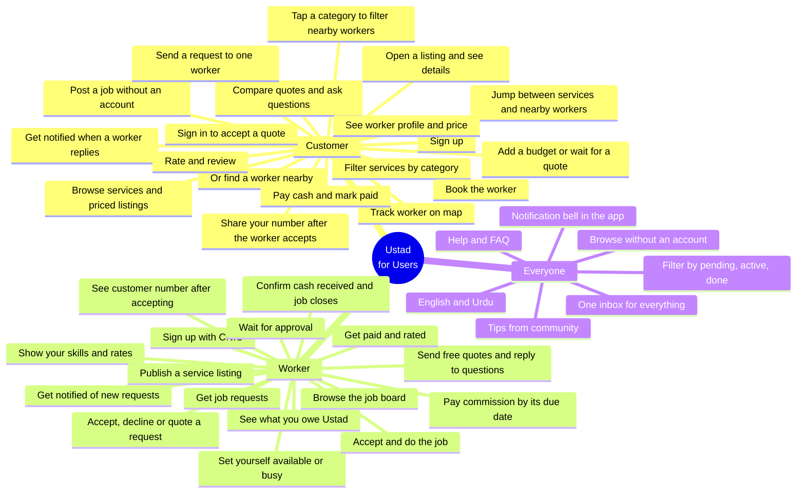
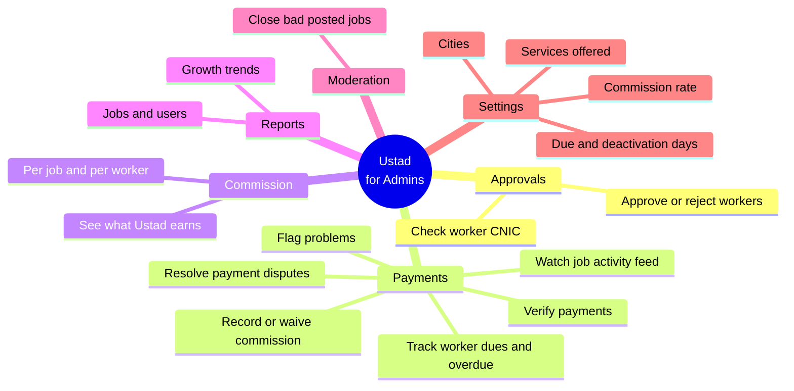
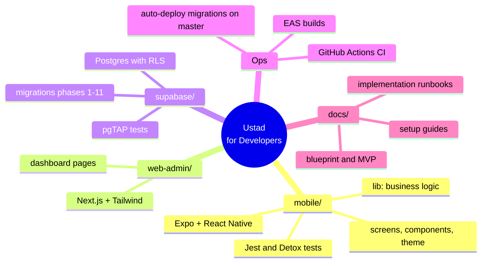

# Ustad — Mind Maps

Three simple views. Interactive tabs: [`mind-map.html`](mind-map.html).

## 1. For Users

```mermaid
mindmap
  root((Ustad<br/>for Users))
    Customer
      Sign up
      Browse services and priced listings
      Filter services by category
      Open a listing and see details
      Or find a worker nearby
      Tap a category to filter nearby workers
      Jump between services and nearby workers
      Post a job without an account
      Compare quotes and ask questions
      Sign in to accept a quote
      Send a request to one worker
      Add a budget or wait for a quote
      See worker profile and price
      Book the worker
      Get notified when a worker replies
      Share your number after the worker accepts
      Track worker on map
      Pay cash and mark paid
      Rate and review
    Worker
      Sign up with CNIC
      Wait for approval
      Show your skills and rates
      Publish a service listing
      Get job requests
      Browse the job board
      Send free quotes and reply to questions
      Get notified of new requests
      Accept, decline or quote a request
      Set yourself available or busy
      Accept and do the job
      See customer number after accepting
      Confirm cash received and job closes
      Get paid and rated
      See what you owe Ustad
      Pay commission by its due date
    Everyone
      English and Urdu
      Browse without an account
      Help and FAQ
      Notification bell in the app
      One inbox for everything
      Filter by pending, active, done
      Tips from community
```

## 2. For Admins

```mermaid
mindmap
  root((Ustad<br/>for Admins))
    Approvals
      Check worker CNIC
      Approve or reject workers
    Payments
      Verify payments
      Track worker dues and overdue
      Record or waive commission
      Watch job activity feed
      Resolve payment disputes
      Flag problems
    Commission
      See what Ustad earns
      Per job and per worker
    Reports
      Jobs and users
      Growth trends
    Moderation
      Close bad posted jobs
    Settings
      Commission rate
      Due and deactivation days
      Services offered
      Cities
```

## 3. For Developers

```mermaid
mindmap
  root((Ustad<br/>for Developers))
    mobile/
      Expo + React Native
      screens, components, theme
      lib: business logic
      Jest and Detox tests
    web-admin/
      Next.js + Tailwind
      dashboard pages
    supabase/
      Postgres with RLS
      migrations phases 1-11
      pgTAP tests
    Ops
      GitHub Actions CI
      auto-deploy migrations on master
      EAS builds
    docs/
      blueprint and MVP
      setup guides
      implementation runbooks
```
